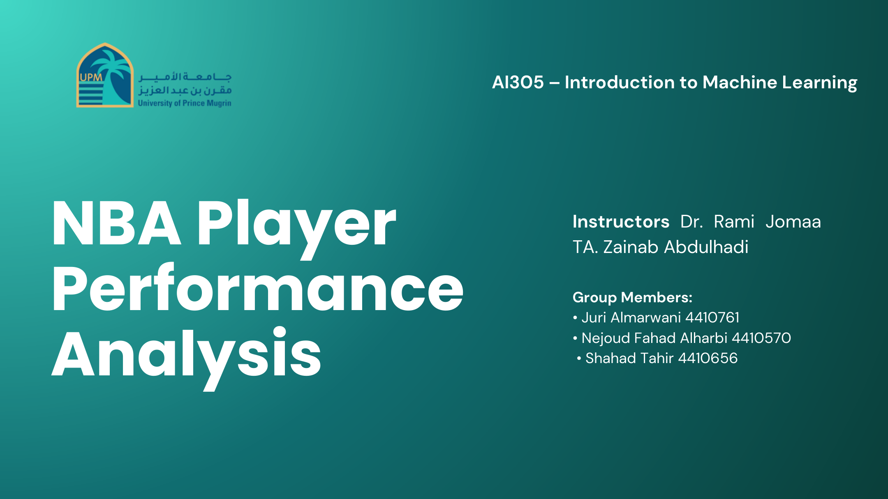

# NBA Player Performance Analysis

### Machine Learning Project for Regression, Classification, Clustering, and Temporal Performance Trends

<p align="center">
  
</p>

## Overview

This project analyzes NBA player performance using multiple machine learning approaches.  
The goal is to understand player performance patterns, predict scoring output, classify game outcomes, identify player archetypes, and study how performance changes over time.

The project combines:

- **Regression** to predict player points
- **Classification** to predict game outcomes
- **Clustering** to identify player archetypes
- **Temporal analysis** to study performance trends across the season

---

## Project Objectives

- Predict player scoring performance using regression models
- Predict Win/Loss outcomes using classification models
- Identify natural player groups using clustering
- Analyze temporal performance changes using rolling averages
- Compare model performance and interpret results clearly

---

## Dataset

The dataset contains per-game NBA player statistics from the 2024/2025 season.  
Each row represents one player's performance in one game.

Key features include:

- Points, assists, rebounds, steals, blocks
- Minutes played
- Field goal, three-point, and free throw percentages
- Turnovers and fouls
- Game result: Win or Loss

---

## Project Structure

<p align="center">
  
</p>

```text
NBA-Player-Performance-Analysis/
│
├── README.md
├── requirements.txt
├── notebooks/
│   └── nba-player-performance-analysis.ipynb
├── docs/
│   ├── phase1-proposal.pdf
│   ├── final-report.pdf
│   └── presentation.pdf
└── assets/
    ├── project-cover.png
    ├── project-structure.png
    ├── regression-results.png
    ├── classification-results.png
    ├── player-archetypes.png
    ├── temporal-analysis.png
    └── model-comparison.png
```

---

## Methods Used

### 1. Regression

The regression task predicts how many points a player will score in a game.

Models used:

- Linear Regression
- Random Forest Regressor
- Support Vector Regression

<p align="center">
  
</p>

---

### 2. Classification

The classification task predicts whether a game result is a Win or Loss based on player statistics.

Models used:

- Logistic Regression
- Random Forest Classifier
- Support Vector Machine

<p align="center">
  
</p>

---

### 3. Clustering

The clustering task identifies player archetypes based on statistical behavior.

Methods used:

- K-Means
- Gaussian Mixture Models
- PCA visualization
- Elbow Method
- Silhouette Score

<p align="center">
  
</p>

---

### 4. Temporal Analysis

The temporal analysis studies how player performance changes over time using rolling averages.

<p align="center">
  
</p>

---

## Additional Visualizations

### Model Comparison

<p align="center">
  
</p>

### Clustering Visualizations

<p align="center">
  
</p>

<p align="center">
  
</p>

### ROC Curve

<p align="center">
  
</p>

---

## Key Findings

- **Random Forest** achieved the strongest performance in regression and classification.
- **GMM** provided flexible clustering and captured overlapping player roles.
- Player performance showed temporal patterns related to momentum, fatigue, and game rhythm.
- Feature engineering improved interpretability and model consistency.

---

## Technologies Used

- Python
- Pandas
- NumPy
- Matplotlib
- Seaborn
- Scikit-learn
- PCA and t-SNE
- Jupyter Notebook

---

## Installation

Install the required packages:

```bash
pip install -r requirements.txt
```

---

## How to Run

Open the notebook:

```bash
jupyter notebook notebooks/nba-player-performance-analysis.ipynb
```

Run the notebook cells from top to bottom.

---

## Team Members

| Name | Contribution |
|---|---|
| Juri Almarwani | Methodology documentation, classification modeling, hyperparameter tuning, and report co-authoring |
| Nejoud Fahad Alharbi | Distribution analysis, feature engineering, clustering analysis, bonus task, and report co-authoring |
| Shahad Tahir | Data cleaning, descriptive statistics, missing value handling, regression modeling, and presentation preparation |

---

## Future Improvements

- Add injury, rest, and opponent strength features
- Use LSTM models for deeper time-series analysis
- Add player tracking data for richer contextual analysis
- Explore advanced clustering methods such as HDBSCAN
- Build an interactive dashboard for visualizing player trends

---

## Final Note

This project demonstrates how machine learning can support sports analytics by combining prediction, clustering, and temporal analysis into one complete performance analysis workflow.
